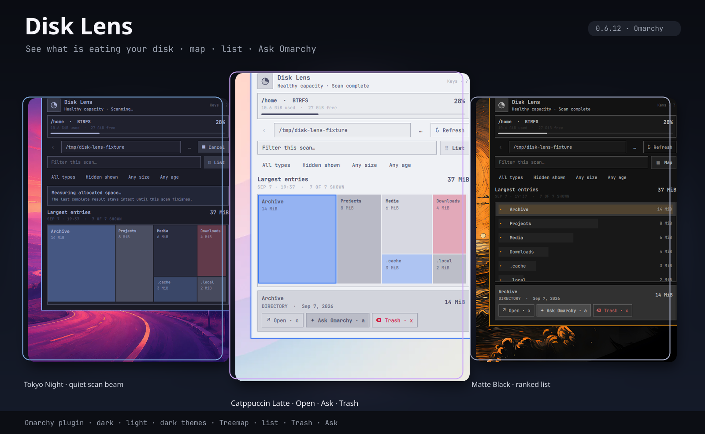

# Omarchy Disk Lens



Disk Lens is a disk usage viewer for the Omarchy bar. If you have used [WinDirStat](https://windirstat.net/) on Windows or [QDirStat](https://github.com/shundhammer/qdirstat) on Linux, you already know the idea: scan a folder and see what is taking up the space. Disk Lens shows the result as either a proportional map or a ranked list. Hidden folders are included by default, so Steam libraries and other large hidden directories are not missed.

Nothing is scanned in the background. Opening the panel shows disk capacity. A folder scan starts only when you ask for one.

## What it does

* Shows the largest files and folders as a treemap or list.
* Accepts typed paths and includes a folder picker.
* Remembers recent results, so Back does not trigger another scan.
* Filters by name, file type, hidden status, allocated size, and modification age.
* Opens a selected entry in the file manager or scans deeper into it.
* Sends a selected folder to **Ask Omarchy** with its measured size and instructions to investigate without making changes.
* Moves one selected entry to desktop Trash after an explicit confirmation.
* Shows scan activity on the bar pie and as a smooth vertical scanner stripe in the results pane.

The scanner stays on the selected filesystem and preserves the last complete result if a refresh is cancelled. Unreadable paths are reported as a partial scan instead of being quietly omitted.

## Install

```bash
omarchy plugin add https://github.com/mtolhuys/omarchy-disk-lens.git --enable
```

Update an installed copy:

```bash
omarchy plugin update io.github.mtolhuys.disk-lens
```

Remove the plugin:

```bash
omarchy plugin remove io.github.mtolhuys.disk-lens
```

Disk Lens requires Omarchy Quattro with support for third party `schemaVersion: 1` services and bar widgets. The normal runtime commands are listed in [the dependency contract](docs/DEPENDENCIES.md). **Ask Omarchy** is the only feature that needs a configured Omarchy coding agent.

## About Trash

Disk Lens never permanently deletes files. The Trash action handles one exact selection at a time, begins on **Cancel**, and leaves the item untouched if the desktop Trash operation is unsupported. Disk space is reclaimed only after Trash is emptied.

The plugin cannot remove files with elevated privileges, clean up multiple entries at once, or empty Trash.


## Keyboard

### Global (Hyprland)

Optional shortcut (add to `~/.config/hypr/bindings.lua`):

```lua
o.bind("SUPER + ALT + D", "Omarchy Disk Lens", "omarchy-shell shell toggle io.github.mtolhuys.disk-lens")
```

Then `hyprctl reload`.

| Shortcut | Action |
| --- | --- |
| **Super + Alt + D** | Toggle the Disk Lens panel |

`Super + K` lists global binds only — in-panel keys below are local to the open panel.

### In panel

A muted **Keys · ?** control sits in the header. Press **?** (or click it) for a compact shortcut sheet.

| Shortcut | Action |
| --- | --- |
| **Esc** | Close help → folder picker → blur field → close panel |
| **r / s** | Scan / Refresh, or Cancel while scanning |
| **Shift + H** | Scan Home |
| **c** | Cancel the active scan |
| **↑ / ↓** (or **j / k**) | Move selection in the ranked list / treemap model |
| **Enter / →** | Drill into a folder, or open the selected item |
| **Backspace / ←** | Go back through scan history |
| **f** or **/** | Focus the filter field |
| **v** | Toggle List / Map view |
| **o** | Open the selection (or current scope) in the file manager; binaries are revealed, not downloaded |
| **a** | Ask Omarchy about the selected folder |
| **x** | Move the selection to Trash (opens Cancel-first confirm) |
| **q** | Close the panel |
| **?** | Toggle the Keys sheet |

Letter shortcuts are ignored while typing in the scope, filter, or folder-browser fields.

## Development

Run the local checks:

```bash
make test
make validate
make showcase
```

Install the exact current working tree on a development machine:

```bash
make update
```

`make update` installs the exact current working tree, including uncommitted edits. It runs the source checks first, then confirms that Omarchy loaded the installed copy. This command changes the current host. Runtime and visual testing belongs in the disposable Plugin Lab:

```bash
cd "$OMARCHY_PLUGIN_LAB_ROOT"
./bin/lab plugin /absolute/path/to/omarchy-disk-lens/tests/lab/acceptance.sh
```

Start with [CONTRIBUTING.md](CONTRIBUTING.md), [the product contract](docs/PRODUCT.md), [the test contract](docs/TESTING.md), and [the screenshot provenance](docs/SCREENSHOTS.md). Verified release evidence is recorded in [RELEASE-EVIDENCE.md](docs/RELEASE-EVIDENCE.md).

## Inspiration and thanks

WinDirStat and QDirStat are the obvious inspirations for Disk Lens. They made the treemap a practical way to understand a full disk. Many thanks to their maintainers and contributors for establishing a pattern that still works so well.

Disk Lens is built specifically for Omarchy. It does not bundle, install, or depend on WinDirStat or QDirStat.

## Status

The current public release is **0.6.1**. See [the release evidence](docs/RELEASE-EVIDENCE.md) for what has been tested and [the roadmap](docs/ROADMAP.md) for what is still planned before version 1.0.

MIT licensed. See [LICENSE](LICENSE).
