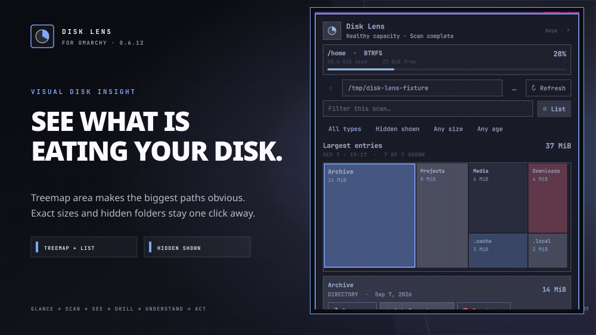

# Omarchy Disk Lens

> A calm, visual answer to “what is eating my disk?” for Omarchy.



Disk Lens puts storage pressure in one quiet Omarchy bar slot. Open it for exact Home-filesystem capacity, explicitly scan one directory, follow the live activity ring, and use the ranked list or proportional treemap to find the branch worth investigating.

Version **0.4.0** is the first public pre-1.0 release. Its complete native journey is verified in a disposable Omarchy desktop; interfaces may still evolve before 1.0.

## The useful path from full disk to a clear next step

- **Glance** — one proportional pie in the bar; no percentage label consuming width and no recursive background scan.
- **Scan deliberately** — immediate children, one filesystem, one same-user process, visible progress, safe cancellation, and the last complete result kept intact.
- **See proportion** — one canonical model powers both the squarified treemap and exact ranked list.
- **Narrow the answer** — search by name and filter by type, hidden status, allocated size, or modification age.
- **Ask before changing** — send one selected directory and its measured allocation to the configured Omarchy agent with a read-only investigation prompt and an explicit confirmation boundary.
- **Stay native** — the complete analysis journey lives in one compact Omarchy panel with no extra graphical analyzer or package workflow.

Disk Lens never scans merely because the panel opened, never silently installs software, never runs a privileged GUI, and exposes no delete or cleanup action. Btrfs capacity, per-path allocated bytes, filtered totals, and partial traversal are deliberately labelled as different facts.

## Current requirements

- Omarchy Quattro with third-party `schemaVersion: 1` service and bar-widget plugin support;
- the normal Omarchy/Arch runtime commands listed in [the dependency contract](docs/DEPENDENCIES.md);
- optionally, a default Omarchy coding agent for **Ask Omarchy**.

Capacity, scanning, treemap, list, filters, navigation, and file-manager actions are self-contained. Only the explicitly activated agent guidance depends on a configured agent.

## Install, update, or remove

Install the current public version and enable it:

```bash
omarchy plugin add https://github.com/mtolhuys/omarchy-disk-lens.git --enable
```

Update an installed copy to the current upstream version:

```bash
omarchy plugin update io.github.mtolhuys.disk-lens
```

Remove Disk Lens without touching scanned files:

```bash
omarchy plugin remove io.github.mtolhuys.disk-lens
```

## Install or update this development tree

From this checkout:

```bash
make update
```

This is the one command that always moves the local Omarchy installation to the exact current working tree, including uncommitted edits. It:

1. runs the source suite and manifest validation;
2. creates a Git snapshot under `${XDG_CACHE_HOME:-$HOME/.cache}/omarchy-disk-lens/development-source`;
3. replaces only `io.github.mtolhuys.disk-lens`;
4. waits for catalog discovery before enabling, so rerunning also repairs an interrupted or discovery-raced install;
5. verifies the installed commit and both loaded runtime identities.

Run this as your normal desktop user. `make dev-install` and `make install` are equivalent aliases. This is an explicit host-mutating maintainer workflow; automated installation, visual, update, and lifecycle tests stay inside the disposable Plugin Lab.

Remove the development copy with:

```bash
omarchy plugin remove io.github.mtolhuys.disk-lens --yes
```

Removal does not touch scanned files.

## Develop and verify

```bash
make test
make validate
make showcase
```

`make showcase` deterministically rebuilds the README tour from current synthetic Plugin Lab captures. Runtime acceptance belongs in the disposable lab:

```bash
cd "$OMARCHY_PLUGIN_LAB_ROOT"
./bin/lab plugin /absolute/path/to/omarchy-disk-lens/tests/lab/acceptance.sh
```

Start with [CONTRIBUTING.md](CONTRIBUTING.md), [the product contract](docs/PRODUCT.md), [the test contract](docs/TESTING.md), and [the screenshot provenance contract](docs/SCREENSHOTS.md). The exact verified boundary and remaining release gates live in [RELEASE-EVIDENCE.md](docs/RELEASE-EVIDENCE.md).

## Status

The `0.4.0` release has source, real-shell, visual, agent-prompt, update, and lifecycle evidence in disposable guests. Quantified performance budgets, dense/narrow layouts, pressure fixtures, complete assistive-technology review, and composed reduced-motion acceptance remain explicit pre-1.0 hardening work.

MIT licensed. See [LICENSE](LICENSE).
