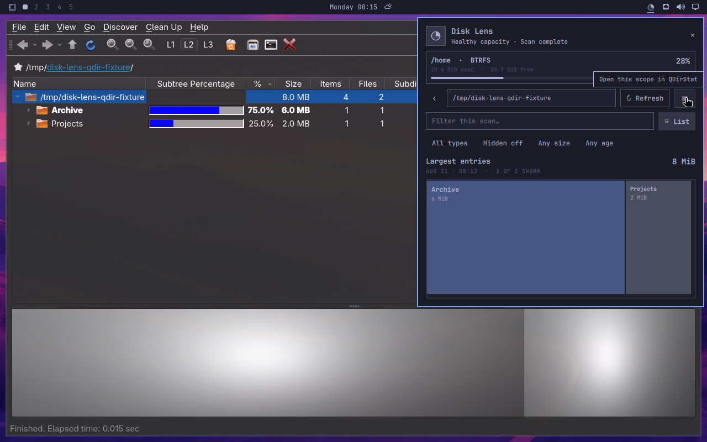

# Omarchy Disk Lens

> A calm, visual answer to “what is eating my disk?” for Omarchy.


Disk Lens puts storage pressure in one quiet Omarchy bar slot. Open it for exact Home-filesystem capacity, explicitly scan one directory, follow the live activity ring, and use the ranked list or proportional treemap to find the branch worth investigating.

Version **0.3.0** is a verified development preview. It is not tagged, published, or submitted to a marketplace, and no minimum public Omarchy version is claimed yet.

## The useful path from full disk to clear next step

- **Glance** — one proportional pie in the bar; no percentage label consuming width and no recursive background scan.
- **Scan deliberately** — immediate children, one filesystem, one same-user process, visible progress, safe cancellation, and the last complete result kept intact.
- **See proportion** — one canonical model powers both the squarified treemap and exact ranked list.
- **Narrow the answer** — search by name and filter by type, hidden status, allocated size, or modification age.
- **Ask before changing** — send one selected directory and its measured allocation to the configured Omarchy agent with a read-only investigation prompt and an explicit confirmation boundary.
- **Go deeper** — open the exact current or selected scope in QDirStat when a full desktop analyzer is the right tool.

Disk Lens never scans merely because the panel opened, never silently installs software, never runs a privileged GUI, and exposes no delete or cleanup action. Btrfs capacity, per-path allocated bytes, filtered totals, and partial traversal are deliberately labelled as different facts.

## ✦ QDirStat deserves the spotlight

<table>
  <tr>
    <td width="58%">
      
    </td>
    <td>
      <h3>Disk Lens finds the branch.<br>QDirStat owns the deep dive.</h3>
      <p><a href="https://github.com/shundhammer/qdirstat">QDirStat</a> is the mature Qt disk analyzer this project deliberately complements instead of weakly reimplementing. Its full tree, treemap, statistics, package views, and deliberate cleanup workflows are the specialist destination behind Disk Lens’s compact overview.</p>
      <p><strong>A standing ovation to <a href="https://github.com/shundhammer">Stefan Hundhammer</a></strong>—creator and maintainer of QDirStat and the original KDirStat—and to <a href="https://github.com/shundhammer/qdirstat/graphs/contributors">every QDirStat contributor</a> who has kept this exceptional open-source lineage useful for decades.</p>
      <p><a href="https://github.com/shundhammer/qdirstat"><strong>★ Star QDirStat</strong></a> · <a href="https://github.com/shundhammer/qdirstat#donate"><strong>Support upstream</strong></a></p>
    </td>
  </tr>
</table>

QDirStat remains optional, separately installed, GPL-2.0 software. Disk Lens contains no QDirStat code, is independently MIT-licensed, and does not imply upstream endorsement.

## Current requirements

- Omarchy with the third-party `schemaVersion: 1` service and bar-widget plugin contract used by the disposable Plugin Lab;
- the normal Omarchy/Arch runtime commands listed in [the dependency contract](docs/DEPENDENCIES.md);
- optionally, QDirStat from the AUR for the specialist hand-off;
- optionally, a default Omarchy coding agent for **Ask Omarchy**.

Core capacity, scanning, treemap, list, filters, navigation, and file-manager actions work without QDirStat or an agent.

## Install or update this development tree

From this checkout:

```bash
make update
```

This is the one command that always moves the local Omarchy installation to the exact current working tree, including uncommitted edits. It:

1. runs the source suite and manifest validation;
2. creates a Git snapshot under `${XDG_CACHE_HOME:-$HOME/.cache}/omarchy-disk-lens/development-source`;
3. replaces only `io.github.mtolhuys.disk-lens`;
4. waits for catalog discovery before enabling, so rerunning also repairs an interrupted or discovery-raced install;
5. verifies the installed commit and both loaded runtime identities.

Do not use `sudo`. `make dev-install` and `make install` are equivalent aliases. This is an explicit host-mutating maintainer workflow; automated installation, visual, package, update, and lifecycle tests stay inside the disposable Plugin Lab.

Remove the development copy with:

```bash
omarchy plugin remove io.github.mtolhuys.disk-lens --yes
```

Removal does not uninstall QDirStat or touch scanned files.

## Develop and verify

```bash
make test
make validate
make showcase
```

`make showcase` deterministically rebuilds the README tour from current synthetic Plugin Lab captures. Runtime acceptance belongs in the disposable lab:

```bash
cd "$OMARCHY_PLUGIN_LAB_ROOT"
./bin/lab plugin /absolute/path/to/omarchy-disk-lens/tests/lab/acceptance.sh
./bin/lab plugin /absolute/path/to/omarchy-disk-lens/tests/lab/qdirstat.sh
```

Start with [CONTRIBUTING.md](CONTRIBUTING.md), [the product contract](docs/PRODUCT.md), [the test contract](docs/TESTING.md), and [the screenshot provenance contract](docs/SCREENSHOTS.md). The exact verified boundary and remaining release gates live in [RELEASE-EVIDENCE.md](docs/RELEASE-EVIDENCE.md).

## Status

The `0.3.0` vertical slice has source, real-shell, visual, agent-prompt, update, lifecycle, and real QDirStat `2.0-1` evidence in disposable guests. Public distribution, a minimum supported Omarchy release, performance budgets, dense/narrow layouts, quantified contrast, complete assistive-technology review, and composed reduced-motion acceptance remain open release gates.

MIT licensed. See [LICENSE](LICENSE).
